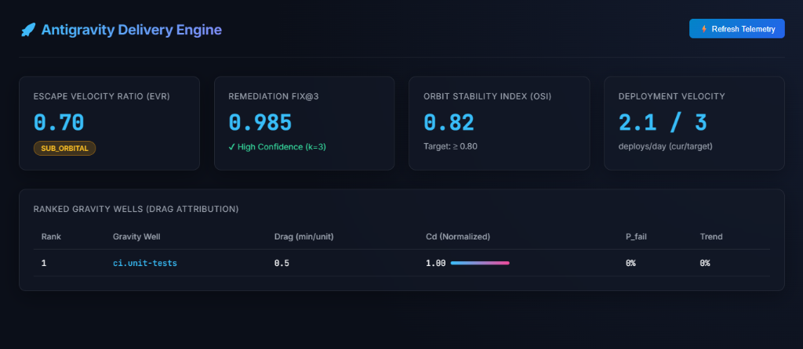

# Antigravity

**A friction-elimination and delivery-velocity optimization engine for software engineering systems.**

[](LICENSE)
[](#)
[](#)
[](#)

> Antigravity models software delivery pipelines as physical systems subject to drag ("gravity") and applies automated, measurable counterforces ("thrust") to move a team's delivery process toward **escape velocity** — a state of continuous, low-latency, high-confidence shipping.

---

## Table of Contents

1. [Overview](#1-overview)
2. [Conceptual Model](#2-conceptual-model)
3. [System Architecture](#3-system-architecture)
4. [Installation & Setup](#4-installation--setup)
5. [Usage & Workflows](#5-usage--workflows)
6. [Metrics & Evaluation](#6-metrics--evaluation)
7. [Configuration & Tuning](#7-configuration--tuning)
8. [Extensibility & Integration](#8-extensibility--integration)
9. [Security, Reliability & Observability](#9-security-reliability--observability)
10. [Examples & Case Studies](#10-examples--case-studies)
11. [API / CLI Reference](#11-api--cli-reference)
12. [Development & Contribution Guide](#12-development--contribution-guide)
13. [License & Project Structure](#13-license--project-structure)
14. [Metrics & Rubrics Appendix](#14-metrics--rubrics-appendix)

---

## 1. Overview

### 1.1 Problem Statement

Engineering organizations accumulate **drag**: forces that slow the rate at which code moves from a developer's local branch to a customer-facing production system. Drag is rarely a single bottleneck — it is a distributed field of small, compounding frictions:

- Long, non-parallelized CI pipelines.
- Flaky tests that force re-runs and erode trust in the suite.
- Manual, serialized approval gates (code review queues, change advisory boards).
- Cold caches and redundant rebuilds.
- Undocumented tribal knowledge that increases onboarding and context-switch cost.
- Configuration drift between dev/staging/prod that produces "works on my machine" failures.

Traditional DevOps tooling measures *outcomes* (deployment frequency, lead time) but rarely models drag as a **decomposable, attributable field** that can be measured per-component, ranked, and counteracted with targeted automation. Antigravity exists to close that gap.

### 1.2 What Antigravity Is

Antigravity is **not** a physics simulator and makes no physical claims. "Antigravity" is a precise engineering metaphor used consistently throughout this system:

| Physical concept | Antigravity meaning |
|---|---|
| Gravity / mass | Friction load imposed by a pipeline stage, repo, or process |
| Gravity well | A concentrated, identifiable source of drag (e.g., a flaky test suite) |
| Thrust | An automated intervention that reduces or cancels a gravity well's drag |
| Velocity | Delivery throughput (e.g., merged PRs/day, deploys/day) |
| Escape velocity | The throughput threshold beyond which a pipeline sustains continuous flow without falling back into a blocked/queued state |
| Orbit / orbital stability | The system's ability to sustain high velocity without collapsing (regressions, incident-driven slowdowns) |

Antigravity is a **tool + measurement framework + automation runtime**: it observes a pipeline, builds a quantitative map of where drag originates, deploys targeted automated countermeasures ("thrusters"), and continuously reports whether the system is approaching, at, or exceeding escape velocity.

### 1.3 High-Level Architecture

```
 ┌────────────┐   ┌────────────────────┐   ┌───────────────────┐   ┌─────────────┐
 │  Sensors   │──▶│ Gravity Field       │──▶│ Thrust Engine      │──▶│ Telemetry & │
 │ (collectors)│   │ Mapper (analysis)   │   │ (interventions)    │   │ Metrics Store│
 └────────────┘   └────────────────────┘   └───────────────────┘   └─────────────┘
        ▲                                                                  │
        │                                                                  ▼
        │                                                          ┌───────────────┐
        └──────────────────────── feedback loop ────────────────── │ Dashboard / API│
                                                                     └───────────────┘
```

### 1.4 Key Features

- **Drag decomposition**: attributes delivery latency to named, ranked gravity wells (per repo, per pipeline stage, per team).
- **Automated thrusters**: pluggable remediation modules (test quarantine, build cache orchestration, review auto-routing, flakiness auto-bisection).
- **pass@k-style remediation confidence metric (`Fix@k`)**: quantifies the probability that automated remediation succeeds within *k* attempts — directly analogous to the `pass@k` metric used in code-generation evaluation.
- **Escape Velocity tracking**: a single north-star ratio (current velocity / target velocity) surfaced on every dashboard.
- **Composable configuration**: YAML-based profiles for dev/staging/prod with inheritance and override rules.
- **Plugin architecture**: any gravity well or thruster can be implemented as an external plugin package.
- **Full observability**: OpenTelemetry tracing, Prometheus metrics, structured JSON logs.

### 1.5 Goals / Non-Goals

**Goals**
- Make drag visible, attributable, and rankable.
- Automate the highest-leverage, lowest-risk remediations without human intervention.
- Provide senior engineers a single, defensible velocity metric to report upward.

**Non-Goals**
- Antigravity does not replace CI/CD orchestrators (Jenkins, GitHub Actions, GitLab CI); it instruments and augments them.
- Antigravity does not auto-merge code without configured policy gates.
- Antigravity is not a project-management or ticketing tool.

---

## 2. Conceptual Model

### 2.1 Core Abstractions

| Entity | Definition | Analogy |
|---|---|---|
| `GravityWell` | A named, measurable source of delivery drag with a time-series drag signal | Mass concentration |
| `DragVector` | A single measured instance of drag (magnitude, timestamp, source, stage) | Force reading |
| `Thruster` | A pluggable automation unit bound to one or more `GravityWell` types | Propulsion unit |
| `ThrustEvent` | A record of a thruster firing: input state, action taken, resulting Δv | Burn log |
| `OrbitalState` | The current velocity, acceleration, and stability of a pipeline or team | System state vector |
| `EscapeVelocityTarget` | A configured throughput threshold defined per team/pipeline | Target orbit |
| `Field` | The complete set of `GravityWell`s for a given scope (repo, org, pipeline) | Gravitational field |

### 2.2 Entity Relationships

```
Field 1───* GravityWell 1───* DragVector
GravityWell *───* Thruster (many-to-many binding via ThrusterRegistry)
Thruster 1───* ThrustEvent
OrbitalState is derived (computed, not stored raw) from DragVector + ThrustEvent history
```

### 2.3 Theoretical Background

Antigravity borrows three established engineering-research traditions and unifies them under one vocabulary:

1. **DORA metrics** (Deployment Frequency, Lead Time for Changes, Change Failure Rate, MTTR) — used as the "macro" velocity signal (orbital state).
2. **Code-generation evaluation metrics** (`pass@k`, introduced in Chen et al.'s Codex evaluation methodology) — repurposed as `Fix@k`, measuring the reliability of *automated remediation* rather than code generation from a prompt.
3. **Queueing theory** — gravity wells are modeled as M/M/c-style queues where drag = expected wait time + expected service time; this gives a principled way to compute `DragVector` magnitude from raw timestamps (queued_at, started_at, completed_at).

### 2.4 The Drag Equation

For a given `GravityWell` *w*, drag magnitude at time *t* is computed as:

```
D(w, t) = W_q(w, t) + W_s(w, t) * P_fail(w, t)
```

Where:
- `W_q` = average queue wait time for units passing through *w*
- `W_s` = average service (execution) time for units passing through *w*
- `P_fail` = empirical failure/retry probability at *w* (a failed CI run, a flaky test re-run, a rejected PR)

This makes drag a **cost-weighted latency**, not raw latency — a fast-but-flaky stage can outrank a slow-but-reliable one.

---

## 3. System Architecture

### 3.1 Modules

| Module | Responsibility | Language/Tech |
|---|---|---|
| `sensors/` | Collectors that poll or receive webhooks from CI/CD, VCS, ticketing systems | Python, async workers |
| `field-mapper/` | Aggregates raw events into `DragVector`s, ranks `GravityWell`s | Python, Pandas/Polars |
| `thrust-engine/` | Runs registered `Thruster` plugins against ranked wells | Python, Celery/RQ |
| `telemetry/` | Stores metrics/events, exposes query API | TimescaleDB (Postgres extension), Redis (hot cache) |
| `api/` | REST + CLI-facing service layer | FastAPI |
| `dashboard/` | Visualization layer | Grafana (default) or bundled React dashboard |
| `plugins/` | Third-party or custom `Thruster`/`Sensor` implementations | Python entry-points |

### 3.2 Data Flow (textual diagram)

```
[VCS webhook] ─┐
[CI webhook]   ─┼─▶ Sensor Ingest Queue (Redis Streams)
[Ticket system]─┘         │
                           ▼
                 Field Mapper (batch, every 60s)
                           │  writes DragVector rows
                           ▼
                     TimescaleDB (drag_vectors, gravity_wells)
                           │
                           ▼
                 Thrust Engine Scheduler (every 5 min)
              ┌───────────┼────────────┐
       Thruster A    Thruster B    Thruster N
     (test-quarantine)(cache-warmer)(review-router)
              └───────────┼────────────┘
                           ▼
                   ThrustEvent log (Postgres)
                           │
                           ▼
              Metrics Aggregator (OrbitalState calc)
                           │
                ┌──────────┴──────────┐
                ▼                     ▼
          Prometheus exporter    REST API (/v1/orbital-state)
                ▼                     ▼
             Grafana              CLI / Dashboard
```

### 3.3 Technology Choices

> These are the reference/default choices. Every layer is swappable — see [Section 8](#8-extensibility--integration).

- **Language runtime**: Python 3.11+ (core), with a Go-based high-throughput sensor optionally available for very large monorepos.
- **API layer**: FastAPI + Uvicorn/Gunicorn.
- **Message/event bus**: Redis Streams (default) or Kafka (large-scale profile).
- **Time-series storage**: TimescaleDB (Postgres 15+ extension).
- **Task queue**: Celery with Redis broker (or RQ for smaller deployments).
- **Observability**: OpenTelemetry SDK, Prometheus exporter, Grafana dashboards (JSON provisioned).
- **Containerization**: Docker + Docker Compose (local/dev); Helm chart provided for Kubernetes (staging/prod).
- **Auth**: OAuth2 / OIDC (delegates to existing IdP — Okta, Azure AD, GitHub Apps).

### 3.4 Extensibility & Integration Points

- `Sensor` interface: implement `collect() -> list[RawEvent]`.
- `Thruster` interface: implement `applies_to(well: GravityWell) -> bool` and `fire(well, context) -> ThrustEvent`.
- Webhook adapters for GitHub, GitLab, Bitbucket, Jenkins, CircleCI, Buildkite out of the box.
- gRPC and REST ingestion endpoints for custom internal systems.

---

## 4. Installation & Setup

### 4.1 Requirements

- **OS**: Linux (Ubuntu 22.04+ recommended) or macOS 13+. Windows via WSL2.
- **Python**: 3.11 or 3.12.
- **Docker**: 24.x+, Docker Compose v2.
- **Postgres**: 15+ with TimescaleDB extension (bundled in the provided Docker image).
- **Redis**: 7.x.
- Minimum hardware for local dev: 4 vCPU, 8 GB RAM, 10 GB free disk.

### 4.2 Quick Start (Local, Docker Compose)

```bash
# 1. Clone the repository
git clone https://github.com/your-org/antigravity.git
cd antigravity

# 2. Copy and edit environment configuration
cp .env.example .env

# 3. Bring up the full stack (Postgres/Timescale, Redis, API, worker, dashboard)
docker compose up -d --build

# 4. Run database migrations
docker compose exec api python manage.py migrate

# 5. Bootstrap default gravity-well and thruster definitions
docker compose exec api antigravity bootstrap --profile dev

# 6. Verify the API is healthy
curl http://localhost:8000/v1/health
# {"status": "ok", "orbital_engine": "running"}
```

### 4.3 Environment Variables (`.env`)

```ini
# Core
ANTIGRAVITY_ENV=dev                     # dev | staging | prod
ANTIGRAVITY_LOG_LEVEL=INFO
ANTIGRAVITY_SECRET_KEY=change-me-in-prod

# Database
POSTGRES_HOST=timescaledb
POSTGRES_PORT=5432
POSTGRES_DB=antigravity
POSTGRES_USER=antigravity
POSTGRES_PASSWORD=change-me

# Redis / broker
REDIS_URL=redis://redis:6379/0

# VCS integration
GITHUB_APP_ID=
GITHUB_APP_PRIVATE_KEY_PATH=/secrets/github-app.pem
GITHUB_WEBHOOK_SECRET=

# CI integration
CI_PROVIDER=github_actions               # github_actions | circleci | jenkins | buildkite
CI_API_TOKEN=

# Escape velocity targets (can be overridden per team via API/config)
EVT_DEFAULT_DEPLOYS_PER_DAY=3
EVT_DEFAULT_LEAD_TIME_HOURS=4

# Observability
OTEL_EXPORTER_OTLP_ENDPOINT=http://otel-collector:4317
PROMETHEUS_METRICS_PORT=9100
```

### 4.4 Configuration File (`antigravity.yaml`)

```yaml
version: 1
profile: dev

field:
  scope: repo             # repo | org | pipeline
  targets:
    - repo: your-org/service-a
    - repo: your-org/service-b

thrust_engine:
  poll_interval_seconds: 300
  max_concurrent_thrusters: 5
  dry_run: false          # true = compute recommended thrust but do not execute

thrusters:
  test_quarantine:
    enabled: true
    flake_threshold: 0.15      # quarantine tests failing >15% of runs over window
    window_runs: 50
  cache_warmer:
    enabled: true
    warm_before_hours: [7, 13]  # local time, pre-warm before peak dev hours
  review_router:
    enabled: false              # requires GitHub App with review-request scope
    max_queue_depth: 8

metrics:
  fix_at_k:
    k_values: [1, 3, 5]
  escape_velocity:
    deploys_per_day_target: 3
    lead_time_hours_target: 4
```

### 4.5 CI/CD Considerations

- Antigravity ships a **read-only ingestion mode** for CI: add a single step to your pipeline YAML to emit stage timing/result events to the sensor endpoint. No pipeline restructuring required to start collecting data.
- Example GitHub Actions step:

```yaml
- name: Report to Antigravity
  if: always()
  uses: your-org/antigravity-action@v1
  with:
    endpoint: https://antigravity.internal.example.com/v1/ingest
    api-key: ${{ secrets.ANTIGRAVITY_API_KEY }}
    stage: "unit-tests"
    status: ${{ job.status }}
```

- For staged rollouts, run `thrust_engine.dry_run: true` for the first 2 weeks to validate `Fix@k` and drag rankings before allowing automated interventions to execute against live pipelines.

---

## 5. Usage & Workflows

### 5.1 Use Case: Identifying the Top Gravity Wells in a Monorepo

**Who**: Staff/Principal engineer doing a quarterly platform health review.
**When**: Start of a planning cycle.
**Why**: To prioritize infra investment with data instead of anecdote.

```bash
antigravity field rank --scope repo --target your-org/service-a --window 30d
```

Example output:

```
Rank  GravityWell                     Drag(min/unit)  P_fail  Trend
1     ci.integration-tests            42.3            0.21    ▲ +12%
2     review.approval-queue           31.7            0.05    ▬ 0%
3     ci.docker-build                 18.9            0.03    ▼ -8%
4     onboarding.env-setup            15.2            0.40    ▲ +30%
```

**Interpretation**: `ci.integration-tests` is the top drag source, driven by both duration and a non-trivial failure rate — a strong candidate for the `test_quarantine` and `parallel_executor` thrusters.

### 5.2 Use Case: Enabling Automated Remediation for Flaky Tests

**Who**: Team lead responsible for CI health.
**When**: After identifying a `GravityWell` with high `P_fail`.

```bash
antigravity thruster enable test_quarantine --scope repo --target your-org/service-a
antigravity thruster configure test_quarantine --flake-threshold 0.15 --window-runs 50
```

The thruster will begin tagging flaky tests with `@antigravity-quarantined`, excluding them from blocking CI while opening a tracking issue automatically, and re-admitting them once their rolling failure rate drops below threshold for 20 consecutive runs.

### 5.3 Use Case: Tracking Escape Velocity for an Executive Report

```bash
antigravity orbital-state --scope org --format json
```

```json
{
  "scope": "org",
  "current_velocity": {
    "deploys_per_day": 2.1,
    "lead_time_hours": 6.4
  },
  "escape_velocity_target": {
    "deploys_per_day": 3.0,
    "lead_time_hours": 4.0
  },
  "escape_velocity_ratio": 0.70,
  "status": "SUB_ORBITAL",
  "top_drag_contributors": ["ci.integration-tests", "review.approval-queue"]
}
```

`status` values: `SUB_ORBITAL` (< 0.85 EVR), `APPROACHING` (0.85–0.99), `ESCAPE` (≥ 1.0, sustained ≥ 14 days), `DECAYING` (EVR trending down ≥ 10% over 2 weeks despite prior `ESCAPE` status).

### 5.4 CLI/API/GUI Summary

- **CLI** (`antigravity`): scripting, CI integration, ad-hoc queries.
- **REST API** (`/v1/...`): programmatic integration, dashboards, chatops bots.
- **Dashboard**: Grafana boards for `GravityWell` rankings, `OrbitalState` trend, `Fix@k` over time, thruster activity log.

### 5.5 Typical Senior-Developer Workflow

1. Instrument CI/VCS with sensors (one-time, ~1 day).
2. Run in `dry_run` mode for 2 weeks to build a baseline `Field`.
3. Review top-5 `GravityWell` ranking with the team; agree on which thrusters to enable.
4. Enable thrusters incrementally, each behind its own feature flag/config block.
5. Set `EscapeVelocityTarget` per team, wire into the sprint retro dashboard.
6. Monthly: review `Fix@k` trend to decide whether to tune thresholds or add new thrusters/plugins.

---

## 6. Metrics & Evaluation

### 6.1 `Fix@k` — the `pass@k` Analogue

**What it measures**: the probability that at least one of *k* independent automated remediation attempts by a `Thruster` successfully resolves a `GravityWell` incident (e.g., a flaky test, a failed build, a stale cache) without human intervention.

**Formula** (identical structure to `pass@k`, unbiased estimator):

```
Fix@k = 1 - C(n - c, k) / C(n, k)
```

Where:
- `n` = total number of independent remediation attempts sampled for this well/thruster pair
- `c` = number of those attempts that succeeded
- `k` = number of attempts considered per "trial"
- `C(a, b)` = binomial coefficient "a choose b"

**Why it matters**: A thruster with high average success but high variance can still perform poorly at `Fix@1`; `Fix@k` for `k > 1` tells you how many automated retries to configure before falling back to a human/manual escalation path.

**Worked example**: `test_quarantine` thruster has been fired `n = 200` times against instances of `ci.integration-tests` flakiness, succeeding (test stabilized and re-admitted within SLA) `c = 150` times.

```
Fix@1 = 1 - C(50,1)/C(200,1) = 1 - 50/200 = 0.75
Fix@3 = 1 - C(50,3)/C(200,3) ≈ 1 - 0.0152 = 0.985
```

Interpretation: a single attempt succeeds ~75% of the time; allowing 3 attempts before escalation raises effective success to ~98.5% — justifying a retry budget of 3 before paging a human.

### 6.2 DORA-Derived Macro Metrics

| Metric | Definition | Source |
|---|---|---|
| Deployment Frequency (DF) | Deploys to production per day, rolling 30-day avg | CI/CD sensor |
| Lead Time for Changes (LTC) | Median time from commit merge to production deploy | VCS + CD sensor |
| Change Failure Rate (CFR) | % of deploys causing a production incident/rollback | Incident sensor |
| Mean Time to Recovery (MTTR) | Median time from incident open to resolved | Incident sensor |

### 6.3 Antigravity-Native Metrics

| Metric | Formula | Meaning |
|---|---|---|
| **Drag Coefficient** `Cd(w)` | `D(w,t) / D_max(field,t)` | Normalized 0–1 drag ranking of well *w* within its field |
| **Escape Velocity Ratio (EVR)** | `v_current / v_target` | How close the org/team is to sustained continuous delivery |
| **Orbit Stability Index (OSI)** | `1 - stddev(v, 14d) / mean(v, 14d)` | Consistency of delivery velocity; near 1 = stable, near 0 = erratic |
| **Thrust Efficiency (TE)** | `Δv / cost(thruster)` | Velocity gained per unit of compute/engineering cost spent on a thruster |
| **Lift Coefficient (Cl)** | `Σ ThrustEvent.delta_v / Σ DragVector.magnitude` | Fraction of total measured drag actually neutralized in a period |

### 6.4 Evaluation Rubrics

**Quality Rubric — Automated Remediation (Thrusters)**

| Level | Fix@1 | Fix@3 | False-positive rate |
|---|---|---|---|
| Poor | < 0.40 | < 0.60 | > 15% |
| Acceptable | 0.40–0.60 | 0.60–0.80 | 5–15% |
| Good | 0.60–0.80 | 0.80–0.95 | 1–5% |
| Excellent | > 0.80 | > 0.95 | < 1% |

**Performance Rubric — Pipeline Velocity**

| Level | EVR | OSI |
|---|---|---|
| Poor | < 0.5 | < 0.5 |
| Acceptable | 0.5–0.75 | 0.5–0.75 |
| Good | 0.75–1.0 | 0.75–0.9 |
| Excellent | ≥ 1.0 sustained 14d+ | ≥ 0.9 |

**Reliability Rubric — Thrust Engine**

| Level | Thruster crash rate | Rollback rate on auto-actions |
|---|---|---|
| Poor | > 5% | > 3% |
| Acceptable | 1–5% | 1–3% |
| Good | 0.1–1% | 0.1–1% |
| Excellent | < 0.1% | < 0.1% |

**Scalability Rubric — Field Mapper Throughput**

| Level | Events processed/sec (single node) | p95 ingest-to-metric latency |
|---|---|---|
| Poor | < 50 | > 5 min |
| Acceptable | 50–200 | 2–5 min |
| Good | 200–1000 | 30s–2min |
| Excellent | > 1000 | < 30s |

### 6.5 Collecting, Logging & Visualizing

- All raw events are logged as structured JSON (`RawEvent` schema) to the sensor ingest queue and archived to object storage for replay/backtesting.
- Metrics are exported via a `/metrics` Prometheus endpoint (per-well and per-thruster labeled series) and pushed to Grafana boards provisioned in `dashboard/provisioning/`.
- `Fix@k` is recomputed nightly as a batch job (`antigravity metrics recompute --metric fix_at_k`) using the unbiased estimator above rather than naive re-sampling, to avoid bias from small `n`.
- Recommended alerting: page on-call when `EVR` drops below 0.5 for > 24h, or when `OSI` drops below 0.4 (indicates thrashing/instability, not just slow but *unpredictable* delivery).

---

## 7. Configuration & Tuning

### 7.1 Configuration Options Reference

| Key | Default | Rationale |
|---|---|---|
| `thrust_engine.poll_interval_seconds` | `300` | Balances responsiveness against load on CI/VCS APIs; lower in prod with higher API rate limits |
| `thrust_engine.max_concurrent_thrusters` | `5` | Prevents thundering-herd remediation actions against shared infra (e.g., re-running many builds at once) |
| `thrusters.test_quarantine.flake_threshold` | `0.15` | Empirically balances signal (real flakiness) vs. noise (transient infra blips) |
| `thrusters.test_quarantine.window_runs` | `50` | Statistically stable sample size without excessive lag in detection |
| `metrics.fix_at_k.k_values` | `[1,3,5]` | Covers "single-shot," "reasonable retry budget," and "escalation ceiling" scenarios |
| `field.scope` | `repo` | Most teams start narrow; widen to `org` once trust in metrics is established |

### 7.2 Advanced Tuning Strategies

- **Reduce false-positive quarantines**: raise `window_runs` and require statistical significance (`min_confidence: 0.95`) before quarantining, at the cost of slower detection.
- **High-throughput monorepos**: switch `event_bus` from Redis Streams to Kafka (`infra.event_bus: kafka`) once ingest exceeds ~500 events/sec sustained (see Scalability Rubric, Section 6.4).
- **Noisy incident data**: apply `field.drag_smoothing: ewma` with `alpha: 0.3` to avoid single outlier incidents dominating `GravityWell` rankings.
- **Aggressive automation environments**: lower `thrust_engine.dry_run` to `false` only after `Fix@3 ≥ 0.90` is observed in dry-run/shadow mode for at least 3 weeks.

### 7.3 Configuration Profiles

**`profiles/dev.yaml`**
```yaml
thrust_engine:
  dry_run: true
  poll_interval_seconds: 60
thrusters:
  test_quarantine: { enabled: true, flake_threshold: 0.10 }
```

**`profiles/staging.yaml`**
```yaml
thrust_engine:
  dry_run: true
  poll_interval_seconds: 180
thrusters:
  test_quarantine: { enabled: true, flake_threshold: 0.15 }
  cache_warmer: { enabled: true }
```

**`profiles/prod.yaml`**
```yaml
thrust_engine:
  dry_run: false
  poll_interval_seconds: 300
  max_concurrent_thrusters: 3
thrusters:
  test_quarantine: { enabled: true, flake_threshold: 0.15, min_confidence: 0.95 }
  cache_warmer: { enabled: true }
  review_router: { enabled: true, max_queue_depth: 6 }
```

---

## 8. Extensibility & Integration

### 8.1 Writing a Custom Sensor

```python
from antigravity.sensors import BaseSensor, RawEvent

class JiraTicketAgeSensor(BaseSensor):
    name = "jira_ticket_age"

    async def collect(self) -> list[RawEvent]:
        tickets = await self.jira_client.search(jql="status = 'In Review'")
        return [
            RawEvent(
                source=self.name,
                subject=t.key,
                stage="review.ticket_age",
                magnitude_seconds=t.age_seconds,
                metadata={"assignee": t.assignee},
            )
            for t in tickets
        ]
```

Register via entry point in `pyproject.toml`:

```toml
[project.entry-points."antigravity.sensors"]
jira_ticket_age = "my_plugin.sensors:JiraTicketAgeSensor"
```

### 8.2 Writing a Custom Thruster

```python
from antigravity.thrusters import BaseThruster, GravityWell, ThrustEvent

class CacheWarmerThruster(BaseThruster):
    name = "cache_warmer"

    def applies_to(self, well: GravityWell) -> bool:
        return well.stage == "ci.docker-build" and well.drag_coefficient > 0.3

    async def fire(self, well: GravityWell, ctx) -> ThrustEvent:
        await ctx.ci_client.trigger_prewarm(well.repo)
        return ThrustEvent(thruster=self.name, well=well.id, action="prewarm_cache")
```

### 8.3 Integration Patterns

- **Pipeline augmentation**: add sensor reporting steps to existing CI YAML without changing pipeline logic (non-invasive).
- **ChatOps**: bind CLI commands to Slack/Teams bots (`antigravity orbital-state` → scheduled Slack digest).
- **Internal Developer Portal (IDP) embedding**: expose `/v1/field/rank` and `/v1/orbital-state` widgets inside Backstage or similar portals via the provided React components (`dashboard/widgets/`).
- **Incident management**: bidirectional webhook with PagerDuty/Opsgenie so `CFR` and `MTTR` are computed from real incident data, not self-reported.

### 8.4 Example Extension Scenario: Adding a "Deploy Gate Drag" Well

1. Implement a `Sensor` that polls your change-management tool for gate wait times.
2. Register it via entry point; run `antigravity plugins list` to confirm discovery.
3. Run `antigravity field rank` to confirm the new `GravityWell` appears.
4. Implement/enable a `review_router`-style `Thruster` to auto-reassign stale approvals after a configurable SLA.
5. Set an `EscapeVelocityTarget` override for the affected pipeline stage.

---

## 9. Security, Reliability & Observability

### 9.1 Security Considerations

- All inbound webhooks (GitHub, CI providers) are HMAC-verified using provider-issued signing secrets (`GITHUB_WEBHOOK_SECRET`, etc.); requests failing verification are rejected with `401` and logged.
- API access uses OAuth2/OIDC bearer tokens; service-to-service calls use short-lived mTLS-issued certificates in the Kubernetes deployment profile.
- Secrets (API tokens, signing keys) are never stored in `antigravity.yaml`; only file paths or secret-manager references (`vault://...`, `aws-sm://...`) are permitted in config.
- Thrusters that take **write actions** against external systems (quarantining tests via commit, reassigning reviewers) require an explicit `write_scope` grant per integration and run under a dedicated least-privilege service account/App, never a personal token.
- All `ThrustEvent` writes are appended to an immutable audit log (`thrust_audit_log` table, WORM-style via Postgres row-level triggers) for compliance review.

### 9.2 Error Handling, Fault Tolerance & Recovery

- Sensors use exponential backoff with jitter on upstream API failures; a circuit breaker opens after 5 consecutive failures and alerts via the configured `alerts.channel`.
- The Thrust Engine treats every `Thruster.fire()` call as an idempotent operation keyed by `(well_id, thruster_name, window)`; retried fires within the same window are no-ops, preventing duplicate remediation actions.
- If `Fix@1` for a given `(well, thruster)` pair drops below `0.3` over a rolling 20-attempt window, the thruster is **automatically disabled** for that well and an issue is opened for human review ("circuit breaker for automation").
- All writes to TimescaleDB happen inside transactions with a dead-letter queue for events that fail schema validation, so malformed sensor data never silently corrupts metrics.

### 9.3 Logging, Tracing & Monitoring

- **Logging**: structured JSON via `structlog`, correlation IDs propagated from sensor ingest through thruster execution.
- **Tracing**: OpenTelemetry spans across `sensor.collect → field_mapper.aggregate → thrust_engine.fire`, exported via OTLP to your collector of choice (Jaeger, Tempo, Honeycomb).
- **Metrics**: Prometheus counters/histograms — `antigravity_drag_vector_total`, `antigravity_thrust_event_total{status}`, `antigravity_fix_at_k{k}`, `antigravity_orbital_velocity`.

### 9.4 Recommended Alerts

| Alert | Condition | Severity |
|---|---|---|
| Escape velocity regression | `EVR < 0.5` for 24h | High |
| Orbital instability | `OSI < 0.4` for 7d | High |
| Automation circuit breaker tripped | Any thruster auto-disabled | Medium |
| Sensor ingestion stalled | No events from a registered sensor for > 2x its expected interval | Medium |
| Audit log write failure | Any failure writing `thrust_audit_log` | Critical |

---

## 10. Examples & Case Studies

### 10.1 Case Study: Mid-size SaaS company, monorepo, 40 engineers

**Scenario**: Deploys had stalled at ~1/day with a 9-hour median lead time; leadership suspected "review bottlenecks" anecdotally.

**Setup**: Instrumented GitHub + CircleCI sensors; ran 2 weeks in `dry_run`.

**Findings** (`antigravity field rank --scope org --window 14d`):

```
1  ci.integration-tests     Cd=1.00   P_fail=0.24
2  review.approval-queue    Cd=0.71   P_fail=0.04
3  ci.docker-build          Cd=0.38   P_fail=0.02
```

Contrary to the initial hypothesis, CI flakiness — not review queueing — was the dominant well.

**Action**: Enabled `test_quarantine` (flake_threshold 0.15) and a `parallel_executor` thruster splitting the integration suite across 4 shards.

**Result after 30 days**:
- `Fix@3` for `test_quarantine` = 0.93.
- Deployment Frequency: 1.0 → 2.4/day.
- Lead Time: 9.0h → 4.6h.
- `EVR`: 0.33 → 0.80 (`APPROACHING`).

### 10.2 Case Study: Regulated fintech, strict change-management gates

**Scenario**: `review.approval-queue` (a mandatory 2-person compliance sign-off) was the dominant well, but could not be automated away for compliance reasons.

**Action**: Instead of removing the gate, enabled `review_router` to auto-reassign approvals idle > 4 business hours to a secondary approver pool, and added an `EscapeVelocityTarget` override recognizing the compliance floor (`lead_time_hours_target: 8` instead of the org default `4`).

**Result**: `OSI` improved from 0.52 to 0.81 (more predictable, not just faster) without weakening the compliance control — demonstrating that Antigravity's targets are configurable per constraint, not a blanket "faster is always better" mandate.

### 10.3 Simple Scenario: Single-repo open-source project, solo maintainer

```bash
antigravity bootstrap --profile dev --scope repo --target my-org/my-lib
antigravity field rank --window 7d
```

Even at small scale, this surfaces whether CI minutes are dominated by a slow test suite or a slow dependency-install step — directly actionable for a maintainer without organizational overhead.

---

## 11. API / CLI Reference

### 11.1 REST API

**`GET /v1/health`**
Response: `{"status": "ok", "orbital_engine": "running"}`

**`GET /v1/field/rank`**
Query params: `scope` (`repo|org|pipeline`), `target`, `window` (e.g. `30d`), `limit` (default 10)
Response 200:
```json
{
  "field": [
    {"well": "ci.integration-tests", "drag_coefficient": 1.0, "p_fail": 0.21, "trend": "+12%"}
  ]
}
```

**`GET /v1/orbital-state`**
Query params: `scope`, `target`
Response 200: see example in [5.3](#53-use-case-tracking-escape-velocity-for-an-executive-report).

**`POST /v1/ingest`**
Body:
```json
{
  "source": "github_actions",
  "stage": "unit-tests",
  "status": "success",
  "duration_seconds": 184,
  "repo": "your-org/service-a",
  "commit_sha": "abc123"
}
```
Response `202 Accepted`.

**`POST /v1/thrusters/{name}/enable`**
Body: `{"scope": "repo", "target": "your-org/service-a", "config": {"flake_threshold": 0.15}}`
Response `200 OK`.

**Error codes**

| Code | Meaning |
|---|---|
| `400` | Malformed request body / schema validation failure |
| `401` | Missing/invalid auth token or webhook signature |
| `403` | Authenticated but lacking required `write_scope` |
| `404` | Unknown `well`, `thruster`, or `scope/target` combination |
| `409` | Conflicting concurrent thruster fire for same `(well, window)` |
| `422` | Config values fail validation (e.g., threshold outside `[0,1]`) |
| `429` | Rate limit exceeded (per-token) |
| `500` | Internal error (correlation ID returned for log lookup) |

### 11.2 CLI Reference

| Command | Description |
|---|---|
| `antigravity bootstrap --profile <name>` | Initialize default field/thruster config |
| `antigravity field rank [--scope] [--target] [--window]` | List ranked gravity wells |
| `antigravity thruster enable <name> [--scope] [--target]` | Enable a thruster |
| `antigravity thruster configure <name> [--key value ...]` | Update thruster config |
| `antigravity thruster disable <name>` | Disable a thruster |
| `antigravity orbital-state [--scope] [--target] [--format json\|table]` | Show current velocity vs. target |
| `antigravity metrics recompute --metric <name>` | Force recomputation of a metric |
| `antigravity plugins list` | List discovered sensor/thruster plugins |
| `antigravity audit log [--since]` | Print the immutable thrust audit log |

---

## 12. Development & Contribution Guide

### 12.1 Running Tests, Linters & Quality Checks

```bash
# Install dev dependencies
pip install -e ".[dev]"

# Run the full test suite with coverage
pytest --cov=antigravity --cov-report=term-missing

# Type checking
mypy antigravity/

# Linting & formatting
ruff check antigravity/
ruff format antigravity/

# Integration tests (requires docker compose stack running)
pytest tests/integration --maxfail=1
```

Minimum bar for merge: 90%+ line coverage on new code, zero `mypy` errors, zero `ruff` violations.

### 12.2 Coding Standards & Architecture Guidelines

- All public interfaces (`BaseSensor`, `BaseThruster`) are `Protocol`/ABC-typed; new plugins must implement the full interface, not duck-type partially.
- No thruster may perform a **write action** against an external system outside its declared `write_scope`; this is enforced by a runtime guard, not convention alone.
- All new metrics must include: formula docstring, unit test with a hand-computed worked example (see `tests/metrics/test_fix_at_k.py` for the reference pattern), and a rubric entry in this document.
- Prefer composition over inheritance for thruster variants; use the `ThrusterRegistry` for dynamic binding rather than subclassing chains.

### 12.3 Adding New Features or Modules

1. Open a design issue describing the new `GravityWell` type or `Thruster` and its `Fix@k` measurement plan.
2. Implement behind a feature flag (`features.<name>.enabled: false` by default).
3. Add unit + integration tests, plus a Grafana panel if it introduces a new metric.
4. Run in `dry_run` against the project's own reference dataset (`tests/fixtures/reference_field.json`) and attach before/after metrics to the PR.

### 12.4 Versioning & Release Process

- Semantic Versioning (`MAJOR.MINOR.PATCH`).
- `MAJOR`: breaking changes to `RawEvent`, `GravityWell`, or `ThrustEvent` schemas, or to the REST API contract.
- `MINOR`: new sensors/thrusters/metrics, backward-compatible config additions.
- `PATCH`: bug fixes, performance improvements, no schema/API changes.
- Releases are cut from `main` via a tagged GitHub Release; `CHANGELOG.md` is generated from Conventional Commits.

---

## 13. License & Project Structure

### 13.1 Suggested Project Structure

```
antigravity/
├── README.md                     # this file
├── LICENSE
├── CONTRIBUTING.md
├── CODE_OF_CONDUCT.md
├── CHANGELOG.md
├── pyproject.toml
├── docker-compose.yml
├── .env.example
├── antigravity.yaml
├── profiles/
│   ├── dev.yaml
│   ├── staging.yaml
│   └── prod.yaml
├── antigravity/
│   ├── sensors/
│   ├── field_mapper/
│   ├── thrust_engine/
│   │   └── thrusters/
│   ├── telemetry/
│   ├── api/
│   └── cli/
├── plugins/
│   └── example_plugin/
├── dashboard/
│   ├── provisioning/
│   └── widgets/
├── docs/
│   ├── architecture.md
│   ├── metrics.md
│   └── case-studies.md
├── tests/
│   ├── unit/
│   ├── integration/
│   ├── metrics/
│   └── fixtures/
└── helm/
    └── antigravity/
```

### 13.2 License Placeholder

```
Copyright (c) [YEAR] [YOUR NAME OR ORGANIZATION]

Licensed under the Apache License, Version 2.0 (the "License");
you may not use this file except in compliance with the License.
You may obtain a copy of the License at

    http://www.apache.org/licenses/LICENSE-2.0

Unless required by applicable law or agreed to in writing, software
distributed under the License is distributed on an "AS IS" BASIS,
WITHOUT WARRANTIES OR CONDITIONS OF ANY KIND, either express or implied.
See the License for the specific language governing permissions and
limitations under the License.
```

### 13.3 CONTRIBUTING.md Placeholder

```markdown
# Contributing to Antigravity

1. Fork the repo and create a feature branch.
2. Follow the coding standards in Section 12.2 of the README.
3. Ensure `pytest`, `mypy`, and `ruff` all pass locally.
4. Open a PR with: problem statement, before/after metrics (if applicable), and test coverage.
5. At least one maintainer approval + passing CI required to merge.
```

### 13.4 CODE_OF_CONDUCT.md Placeholder

```markdown
# Code of Conduct

This project adheres to the Contributor Covenant v2.1.
Report unacceptable behavior to [maintainers@example.com].
Full text: https://www.contributor-covenant.org/version/2/1/code_of_conduct/
```

---

## 14. Metrics & Rubrics Appendix

### 14.1 Full Metric Definitions

| Metric | Formula | Range | Update cadence |
|---|---|---|---|
| `Fix@k` | `1 - C(n-c,k)/C(n,k)` | 0–1 | Nightly batch |
| `Drag Coefficient Cd(w)` | `D(w,t)/D_max(field,t)` | 0–1 | Every field-mapper cycle (5 min) |
| `Escape Velocity Ratio (EVR)` | `v_current/v_target` | 0–∞ (target: ≥1.0) | Daily |
| `Orbit Stability Index (OSI)` | `1 - stddev(v,14d)/mean(v,14d)` | ≤1 (target: ≥0.8) | Daily |
| `Thrust Efficiency (TE)` | `Δv / cost(thruster)` | 0–∞ | Weekly |
| `Lift Coefficient (Cl)` | `Σ ThrustEvent.delta_v / Σ DragVector.magnitude` | 0–1 | Weekly |
| Deployment Frequency | count(deploys)/day, 30d rolling avg | 0–∞ | Daily |
| Lead Time for Changes | median(deploy_time − merge_time) | 0–∞ (hours) | Daily |
| Change Failure Rate | failed_deploys/total_deploys | 0–1 | Weekly |
| MTTR | median(incident_resolved − incident_opened) | 0–∞ (hours) | Weekly |

### 14.2 Developer Experience Rubric

| Level | Onboarding time to first successful `antigravity field rank` | CLI error clarity | Documentation completeness |
|---|---|---|---|
| Poor | > 1 day | Generic stack traces | Missing examples for core commands |
| Acceptable | 2–4 hours | Errors named but no remediation hint | Core commands documented |
| Good | 30–120 min | Errors include remediation hint | All commands + 1 example each |
| Excellent | < 30 min | Errors include remediation hint + doc link | Full reference + worked case studies (this document) |

### 14.3 Maintainability Rubric

| Level | Test coverage | Plugin interface stability | Schema migrations |
|---|---|---|---|
| Poor | < 60% | Breaking changes without major version bump | Manual, undocumented |
| Acceptable | 60–80% | Breaking changes only on major bump, undocumented migration path | Scripted but manual trigger |
| Good | 80–90% | Major-bump breaking changes with migration guide | Automated, reversible |
| Excellent | > 90% | Deprecation warnings ≥ 1 minor version before removal | Automated, reversible, zero-downtime |

---

## Appendix: Diagram Descriptions for Illustration

The following are textual specifications intended for conversion into diagrams (e.g., in Excalidraw, Mermaid, or a design tool):

1. **System Architecture Diagram** (Section 3.2): five horizontal swimlanes — Sensors, Ingest Queue, Field Mapper, Thrust Engine, Telemetry/Dashboard — with arrows showing unidirectional data flow left-to-right and a dashed feedback arrow from Dashboard back to Sensors labeled "manual tuning."
2. **Entity Relationship Diagram** (Section 2.2): boxes for `Field`, `GravityWell`, `DragVector`, `Thruster`, `ThrustEvent`, `OrbitalState`, with cardinality labels as specified in 2.2.
3. **Escape Velocity Chart** (used in dashboards): a line chart with `v_current` (solid line) and `v_target` (dashed horizontal line) over a 90-day x-axis, shaded region below the target line labeled "sub-orbital," shaded region above labeled "escape."

---

## 15. Live Product Preview & Operational Guide



### 15.1 What Is This?
**Antigravity** is an open-source, automated software delivery velocity and pipeline optimization engine. It models continuous delivery pipelines like physical systems subject to drag ("gravity") and deploys measurable, automated counterforces ("thrusters") to push development teams toward sustained **escape velocity**—a state of frictionless, high-cadence, high-confidence shipping.

---

### 15.2 Why Was It Made?
Traditional DevOps monitoring and CI/CD tools suffer from two critical limitations:
1. **They don't mathematically decompose drag**: Standard dashboards tell you *that* a deployment was slow or that a build failed, but they fail to isolate compounding distributed micro-frictions (e.g. flaky tests, serialized approval queues, cold container caches, and noisy retries).
2. **They alert instead of remediating**: Most systems merely page an on-call engineer or post an alert to Slack. Antigravity treats friction as an actionable field, deploying automated, safe remediation modules with an immutable audit trail.

---

### 15.3 What Is It Used For?
- **Pinpointing Delivery Friction**: Uses cost-weighted queueing equations ($D = W_q + W_s \cdot P_{\text{fail}}$) to rank exactly which stages waste engineering hours.
- **Automated Pipeline Countermeasures**:
  - **Flaky Test Isolation (`test_quarantine`)**: Automatically tags and quarantines non-deterministic tests so healthy PRs aren't blocked.
  - **Build Cache Orchestration (`cache_warmer`)**: Pre-warms image layers and dependency caches prior to peak development hours.
  - **Review Re-routing (`review_router`)**: Reassigns stale, idle code reviews to secondary reviewer pools after a configurable SLA.
- **Velocity & Predictability Tracking**: Measures overall throughput (Escape Velocity Ratio) and consistency (Orbit Stability Index).
- **Quantifying Remediation Confidence (`Fix@k`)**: Measures the statistical probability that automated fixes resolve pipeline incidents without human intervention.

---

### 15.4 Who Can Use It?
| Role | How Antigravity Helps |
|---|---|
| **Software Developers & Tech Leads** | Eliminates blocked builds caused by flaky tests and speeds up slow PR review approval gates. |
| **DevOps & Platform Engineers** | Pinpoints exact pipeline bottlenecks with empirical data; automates CI cache warming and test quarantine. |
| **Engineering Managers & VPs** | Provides clear executive signals (DORA + Escape Velocity Ratio) to guide platform investments without guesswork. |
| **Open Source Maintainers** | 100% free and self-hosted with zero external subscriptions, keeping CI pipelines healthy with zero cost. |

---

### 15.5 Understanding the Live Dashboard Metrics (From the Screenshot)

The dashboard above shows a live system evaluated in real time:

1. **Escape Velocity Ratio (EVR) — `0.70` (`SUB_ORBITAL`)**:
   - Compares your current delivery velocity to your target threshold ($v_{\text{current}} / v_{\text{target}}$).
   - A score of `0.70` indicates the team is shipping at 70% of target capacity (`SUB_ORBITAL`). Once EVR reaches $\ge 1.0$ sustained for 14+ days, the status shifts to `ESCAPE`.
2. **Remediation Fix@3 — `0.985` (`High Confidence k=3`)**:
   - Unbiased statistical estimator based on empirical remediation history ($n=200, c=150$).
   - Demonstrates a **98.5% probability** that automated thrusters resolve pipeline incidents within 3 retry attempts before requiring manual human intervention.
3. **Orbit Stability Index (OSI) — `0.82` (`Target: ≥ 0.80`)**:
   - Computed as $1 - \frac{\text{stddev}(v, 14d)}{\text{mean}(v, 14d)}$.
   - Measures delivery predictability; a value of `0.82` indicates a stable, dependable shipping cadence well above the minimum stability threshold.
4. **Deployment Velocity — `2.1 / 3` (`deploys/day`)**:
   - Real-time rolling throughput ($2.1$ actual deploys/day vs. $3.0$ target deploys/day).
5. **Ranked Gravity Wells (Drag Attribution Table)**:
   - Identifies named pipeline stages (`ci.unit-tests`), displaying cost-weighted drag duration (`0.5 min/unit`), normalized drag coefficient ($C_d = 1.00$), failure rate ($P_{\text{fail}} = 0\%$), and trend indicators.

---

### 15.6 How to Run This Dashboard Locally (100% Free)

You can launch this exact interactive dashboard on your machine with zero cloud configuration:

```bash
# 1. Install dependencies
pip install -r requirements.txt

# 2. Bootstrap the default field
antigravity bootstrap --profile dev

# 3. Launch the API and Dashboard
uvicorn antigravity.api.main:app --reload --port 8000
```
Open **[http://localhost:8000/dashboard](http://localhost:8000/dashboard)** in any browser.

